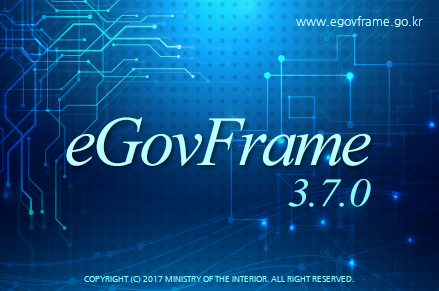

> **:: 업무**

이곳에는 개발 프리랜서들이 여럿 있다.

서버, 웹, DB, 빅데이터, ERP등등

서버는 다른 업체의 프리랜서들이 담당하며 사무실이 다르다

그 외의 파트는 내가 소속해 있는 업체에서 진행하며 모두 같은 사무실을 쓰고있다.

나는 웹 개발쪽에 속해있으며 

모든 프로젝트(사이트) 들은 전자정부 프레임워크 기반으로 제작되었다.

버전이나 사용된 라이브러리들에 차이가 조금 있을뿐

코드는 대부분 비슷하다

> **:: 내부 직원서비스**

사용기술

* Spring (전자정부프레임워크)
* WebSquare (UI)
* JQUERY (Script)
* Oracle (DB)
* Jeus (WAS)
* ClipReport (Report Tool)
* WebtoB (Server) - 아마도...
* Jenkins (Deploy Tool)
* ERP (SAP) - 이건내가 안함

내부 직원들이 증명서 발급받고 연차신청하고 등등 내부 공사 직원들이 이용하는 시스템이다.

2023년 1월 고도화 프로젝트를 진행했고 추가 기능 개발 & 유지보수를 진행하고 있다.

> **:: 사내 인강 사이트(?)**

사용기술

* Spring (전자정부 안씀)
* JQUERY (Script)
* Tibero (DB)
* Jeus (WAS)
* WebToB (Server)
* ERP (SAP) - 내가안함

사내 직원들이 업무 관련된 강의를 들을수 있다

2023년 고도화를 진행해서 아마 플렛폼 업체에서 개발한거로 아는데

이거 완전 개판이라 현업 담당부서와 내가 골치아파하는 일이다.

내가 추가개발과 유지보수를 담당하기로 했지만 소스코드를 3개월 넘게 안줘서 컴플레인 전화만 열심히 받았다

> **:: 계약 관련 사이트**

* Spring (전자정부프레임워크)
* JQUERY (Script)
* Oracle (DB) 
* (WAS 기억안남)
* Linux (Server)
* ERP (SAP) - 내가안함

공사에서 계약된 모든 내용이 있는 사이트다.

용역 물품 등등의 계약이 올라와있다

> **:: 마무리**

이거말고 한국공항공사 홈페이지나 다른 업무들도 가끔 보는데

주 업무들만 일단 정리 해 두었다.

업무량은 

계약관련사이트, 인강사이트  <<<<< 내부 직원 서비스

순으로 많다

(내부직원서비스는 담당자가 연차여야지 일이 안들어온다.. 다른건 그나마 나은편)