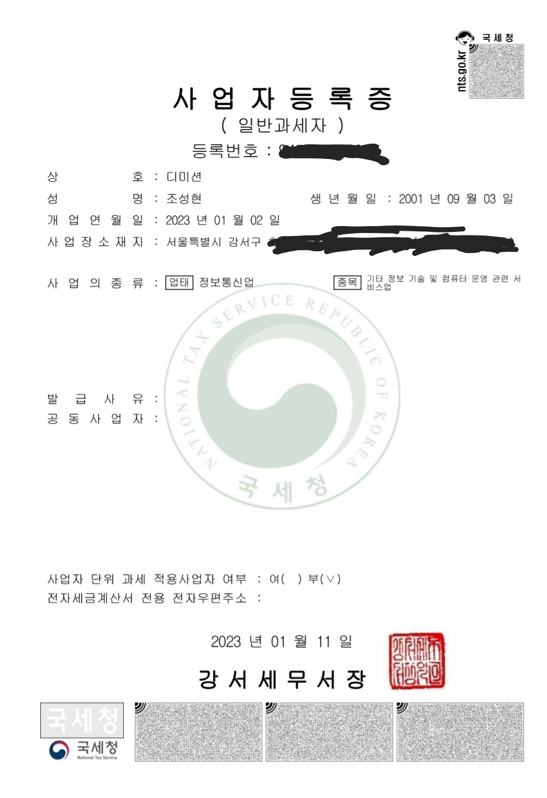

> **:: 사업자 등록**

사업자 등록은 손텍스에서 진행했다.

등록 방법은 아래 글에서 상세히 설명을 해주니 나보다 전문가인 사람의 글을 보도록 하자

<https://www.sixshop.com/official-blog/사업자-등록하는-법-총정리-feat-3일내-발급-가능-bvgizq>

주 업종 코드만 “ ” 이거로 해주면 된다.

(까먹어서 나중에 찾아보고 적어두겠슴당)

사업자 등록은 빠르면 당일 느려도 다음날 오전에 됨

> **:: 세금계산서**

본인은 월말에 당월에 일한 비용에 관한 청구를 한다.

세금계산서 발급에 관한 안내도 전문가의 글을 보도록 하자

월 소득이 500 이상이면 은행 또는 세무사에서 보안카드 또는 인증서를 발급하여 인증을 해야 된다

(해당과정이 있고 없고만 차이가 있을뿐 모든 과정은 동일하다)

https://help.jobis.co/hc/ko/articles/900004686583--첫-세금계산서-발행하는-방법-30초-컷-

이렇게 세금계산서를 하고나면 다음달 15일 (회사의 월급일) 에 부가세 10%를 더해서 입금된다.

전에 말했던데로 부가세 10%도 내돈이라 생각하고 쓰면 큰일난다. 종소세 신고할때 내야한다.

막상 쓰고나니 내가 설명한건 1도 없는거같다.

사업자 내는거는 그냥 몇가지만 작성하고 등록 누르면 되는거고

세금계산서는 정규직, 알바할때는 그냥 자동으로 나오던 월급을 달라고 청구해야하는(?) 번거로움 있는거 빼고는 비슷하다.

프리랜서 관련해서 쓸 내용이 생각나지 않으므로 

다음 글은 회사 업무에 관련해서 쓰겠슴당